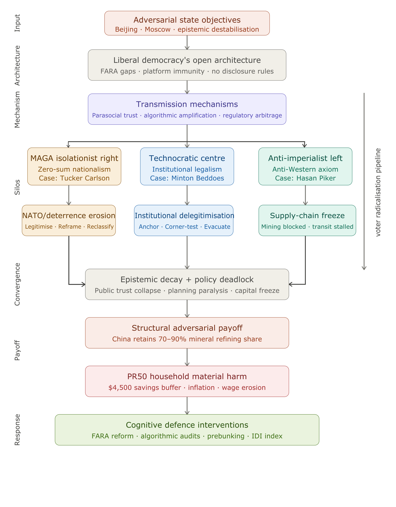

# The Luxury of Nihilism: How Western Influencers Became the Attention Economy's Useful Idiots

  
*This piece applies systems-level risk modeling to the intersection of digital information operations, geopolitical competition, and critical infrastructure investment. It identifies structural feedback loops across three ideological archetypes and traces their downstream material costs to the median American household and Western energy transition capacity.*

# Executive Summary: The Luxury of Nihilism

**Problem Statement**
Liberal democracies are experiencing a structural failure where foreign adversarial narratives are amplified by domestic digital influencers, leading to epistemic destabilization and the paralysis of critical policy planning.

## The Three-Vector Framework
* **Isolationist Right:** Weaponizes institutional distrust to frame multilateral security commitments as net subtractions from national sovereignty.
* **Technocratic Center:** Suffers from an over-reliance on institutionalist vocabulary, which becomes a liability when delegitimized by populist interlocutors.
* **Anti-Imperialist Left:** Utilizes an asymmetric prior that grants legitimacy to anti-Western regimes, facilitating frictionless narrative insertion.

## Material Stakes
This epistemic decay results in a direct tax on the median American household through economic volatility and the "capital freeze" of essential infrastructure. It creates a systemic inability to execute long-term spatial and environmental adaptations, leaving Western states vulnerable to physical and economic shocks.

## Proposed Policy Levers
1. **Algorithmic Transparency:** Mandate real-time API access for verified researchers to identify coordinated inauthentic amplification.
2. **Financial Disclosure:** Expand registration frameworks to require permanent digital watermarks on media content produced with foreign-linked state assistance.
3. **Inoculation Infrastructure:** Fund "prebunking" curricula in educational settings to build psychological resistance to adversarial narrative techniques.
4. **Influence Drift Index (IDI):** Adopt standardized metrics for NGOs to measure the statistical overlap between influencer output and adversarial strategic messaging.

## Introduction: The Structural Paradox of Liberal Democracy's Open Architecture

Liberal democracy's most powerful institutional feature — the legal protection of free speech, open platforms, and the right to dissent without disclosure — has become the primary delivery mechanism for a new generation of adversarial influence operations. This is not a peripheral vulnerability or a theoretical edge case. It is the load-bearing architectural flaw that authoritarian states have systematically reverse-engineered over the past decade. The foreign agent registration laws, the platform liability shields, the creator monetization frameworks — all were designed for a broadcast-era information environment that no longer exists. In their place, a decentralized, algorithmically-amplified attention economy has emerged, and within it, a class of independent content creators now performs — without disclosure, without audit, and often without conscious intent — functions that a previous generation of Soviet operational planners would have recognised immediately.

The term *poleznye idioty* — "useful idiots" — originated within the operational vocabulary of Soviet political warfare. It does not denote a deficit of raw intelligence. In geopolitical analysis, it designates an intellectual, commentator, or media actor who — contingent upon ideological rigidity, vanity, or domestic grievance — functions as a transmission vector for a foreign adversary's strategic narrative. The structural prerequisite of this role is self-deluding conviction: the useful idiot operates through organic alignment with adversarial objectives, not through covert financial enlistment. It is this organic quality — the absence of a traceable payment, a registered relationship, a detectable coordination — that makes the modern digital useful idiot not merely tolerated by liberal democratic legal architecture, but actively protected by it.

The modern Western influencer has industrialized this function. Operating under the protective legal canopy of free speech and platform neutrality, they have transformed the traditional useful-idiot role into a scalable, high-margin digital enterprise. The baseline probability of sustained narrative transfer scales non-linearly with the depth of parasocial bonding between creator and audience: the stronger the parasocial relationship, the lower the audience's epistemic friction against absorbing the creator's framing. These actors exchange domestic social cohesion for algorithmic engagement, functioning as de facto frontline assets for authoritarian regimes whose primary strategic objective is to degrade Western democratic resilience from the inside out — and the legal architecture of the societies they undermine guarantees them the right to do so.

---

## 1. The Mechanics of Modern Information Operations

To analyze how digital influencers function within adversarial information operations, one must first establish a baseline taxonomy of the three distinct threat vectors that comprise this domain. Blurring these categories reduces analytical utility and produces systematically flawed policy responses:

**1. Coordinated / Compensated Actors:** Individuals or entities with documented financial, contractual, or operational relationships with foreign state media or intelligence organs — e.g., state-backed propaganda contracts.

**2. Opportunistically Amplified Actors:** Independent domestic voices whose content is selectively boosted by foreign state-linked bot networks and coordinated inauthentic behaviour (CIB) without the creator's explicit knowledge or consent.

**3. Organic Aligned Voices:** Creators who hold genuine, self-derived ideological positions that run structurally parallel to an adversary's strategic objectives.

The modern digital influencer typically occupies the intersection of the second and third categories. Authoritarian state-directed information operations targeting Western democracies have shifted away from old-world ideological conversion toward a model of systematic epistemic destabilization. The objective is not to persuade Western audiences of the moral superiority of Beijing or Moscow; it is to pollute the information ecosystem so comprehensively that the concept of verifiable truth is rendered operationally obsolete — inducing the strategic paralysis that follows from irresolvable epistemic uncertainty.

This mechanism relies on laundering adversarial narratives through trusted, counter-cultural personal brands. State-directed media apparatuses like CGTN or RT carry steep institutional distrust costs among Western youth demographics. To bypass this transmission bottleneck, foreign influence operations exploit the perceived authenticity of independent content creators. When an influencer integrates a state-vetted narrative into a casual live stream, they effectively subsidize foreign propaganda by leveraging the accumulated parasocial capital of their platform (Marwick and Lewis, 2017).

Foreign states also engage in **algorithmic opportunism**: automated networks artificially inflate the engagement metrics of extreme domestic voices (Woolley and Howard, 2016). By distorting the digital marketplace of ideas, external actors amplify pre-existing internal cleavages — economic inequality, partisan resentment, institutional distrust — transforming structurally valid domestic debates into toxic, unbridgeable deadlocks (Tucker et al., 2018). The feedback loop is self-reinforcing: amplified extremity drives platform engagement, which drives further algorithmic distribution, which deepens audience radicalization and reduces the marginal cost of subsequent adversarial narrative insertion.

This dynamic raises a diagnostic question that the taxonomy above deliberately leaves open: to what extent can these actors be classified as genuinely unwitting vectors? The hypothesis of pure ideological innocence becomes statistically implausible when applied to media professionals operating multi-million dollar production enterprises with real-time access to granular audience analytics, A/B-tested content strategies, and sophisticated monetization infrastructure. These are not confused civilians stumbling into geopolitical adjacency. They are hyper-aware, financialized entertainers — modern court jesters within the attention economy — whose primary operational metric is not truth-seeking but dwell time. Their core business model is the gamification of domestic grievance for private equity accumulation, not the rigorous structural interrogation of geopolitical reality.

Yet the most operationally significant insight is this: *the question of individual intent is, structurally, a distraction.* Whether a given influencer consciously serves adversarial objectives or simply optimizes for the same outputs by accident is largely irrelevant to the downstream systemic damage. Both the witting asset and the unwitting vector produce functionally identical information pollution. The grey zone between them is precisely what makes this class of actor so difficult to regulate, so easy to defend, and so valuable to adversarial states. The correct analytical frame is not moral — it is structural. The question is not whether they know, but whether the architecture they operate within guarantees the same output regardless.

---

## 2. The Triad of Western Information Pollution

The contemporary Western information ecosystem is fractured into three distinct ideological silos, each generating its own dominant archetype of the useful idiot, each with structurally distinct operational blind spots.

### 2.1 The MAGA Isolationist Right

Driven by an entrenched anti-globalist framework and intense domestic partisan resentment, this faction processes foreign policy entirely through the lens of the American culture war. Their structural blind spot is an asymmetric distribution of skepticism: categorical distrust of multilateral Western institutions paired with uncritical romanticization of the "strongman" archetype, systematically contrasted against a perceived weak, decadent Western liberalism. The operative logic is zero-sum and binary — America's participation in any multilateral commitment is framed not as collective security investment, but as a net subtraction from American sovereign capacity: a forced subsidy of ungrateful allies at the expense of domestic constituents. While championing the zero-sum logic of "America First, otherwise America loses," this faction functions as a structural accelerant for precisely the adversarial geopolitical expansionism it claims to oppose.

**Prominent Case: Tucker Carlson.** Carlson's February 2024 interview with Vladimir Putin and his subsequent commentary praising Moscow's retail infrastructure serve as a baseline manifestation of this transmission dynamic. The causal chain operates across three sequential steps:

**Step 1 — Legitimization:** By framing Russia as a functional, traditionally-grounded society rather than a kleptocratic authoritarian state, Carlson's coverage implicitly dismantles the moral justification for treating Russia as a structural threat. If Moscow is competent, stable, and culturally coherent, then Western alarm over its territorial ambitions reads not as rational deterrence, but as institutional hysteria — or worse, as deliberate fearmongering by the same liberal establishment the MAGA base already distrusts.

**Step 2 — Reframing:** Once Russia is de-threatenified in the audience's prior, the cost-benefit calculus of NATO membership and European security commitments shifts. If Russia poses no credible civilizational threat, then US financial and military commitments to European defence are no longer hard security investments — they become discretionary transfers to wealthy European nations who should fund their own defence. NATO transforms from a load-bearing pillar of Western deterrence into a globalist wealth redistribution scheme.

**Step 3 — Reclassification:** With that reframing in place, any domestic politician or institution that advocates for sustained NATO commitments is no longer defending a national security architecture — they are, by the internal logic of this narrative, choosing European elites over American workers. The commitment itself becomes a culture-war proxy. Supporting Ukraine aid or NATO burden-sharing reads as a tribal signal of liberal establishment loyalty rather than a strategic calculation. This reclassification is the adversary's downstream payoff: it makes Western deterrence politically costly to maintain and electorally expensive to defend, directly lowering the geopolitical expansion costs for Moscow without requiring a single act of covert influence.

The core mechanism is that Carlson's coverage does not need to explicitly argue against NATO — it simply needs to corrode the premise that Russia is dangerous enough to justify the alliance's cost. Once that premise collapses in the audience's prior, the entire deterrence architecture loses its domestic political foundation. Whether Carlson understands this mechanism precisely or arrives at it through ideological instinct is, again, operationally irrelevant. The output is identical either way.

---

### 2.2 The Technocratic Neoliberal Center

Operating under the assumption of institutionalist neutrality, this cluster processes geopolitical volatility and structural conflict as administrative friction to be resolved through rule-of-law frameworks, multinational forums, and managed market access. Critically, these tools carry genuine legitimacy — they feel inherently *fair* and *value-based* to Western audiences precisely because they are the institutional grammar Western liberal democracies have spoken for eighty years. That perceived legitimacy is also their principal vulnerability. Their structural blind spot is an over-reliance on legalistic and institutional consensus as the primary epistemic register — a dependency that creates acute, exploitable exposure when those foundational axioms are subjected to aggressive, counter-cultural cross-examination by interlocutors who do not share the same normative premises.

**Prominent Case: Zanny Minton Beddoes (Editor-in-Chief, *The Economist*).** While Minton Beddoes has maintained an editorially hawkish institutional stance toward major authoritarian state powers, her early-2026 extended interview with Tucker Carlson exposed a characteristic centrist operational vulnerability. The encounter functions as a clean diagnostic of what happens when technocratic legalism meets raw populist rhetoric. The causal chain operates across three sequential steps:

**Step 1 — Anchoring:** Minton Beddoes entered the exchange anchored to the post-war institutional vocabulary: established definitions of international norms, statehood, sovereignty, and the "right to exist." Within that framework, her positions are internally coherent and defensible. The structural problem is that this vocabulary assumes a shared normative baseline — that both interlocutors accept the legitimacy of the institutions and definitions being invoked. Carlson does not share that baseline, and does not pretend to.

**Step 2 — Corner-Testing:** Carlson systematically weaponized her institutional anchoring by corner-testing every abstraction against visceral, ground-level specifics: localized human suffering, Western fiscal overextension, the gap between declared norms and observable outcomes. Each time Minton Beddoes defended a position through institutional or legal framing — *international law holds that...*, *the post-war consensus establishes...* — Carlson redirected to a concrete, emotionally legible counter-image that the framework could not absorb without appearing cold, evasive, or captured by elite interest. The institutional vocabulary, designed for coherent policy discourse among shared-premise actors, becomes a liability when deployed against a bad-faith interlocutor whose strategic objective is to expose its distance from lived reality.

**Step 3 — Audience Evacuation:** The downstream output was a rhetorical no-man's land. The centrist position, stripped of its normative authority by Carlson's corner-testing, produced arguments that satisfied neither the anti-war left — for whom institutional frameworks read as cover for Western power projection — nor the nationalist right, for whom they read as globalist abstraction divorced from American interest. The encounter did not merely make Minton Beddoes look flat-footed; it structurally discredited the *mode of argumentation* that centrist institutions depend upon. The measurable downstream cost is public clarity on core national security imperatives: when the technocratic centre's institutional register is successfully delegitimized in front of a mass audience, the policy consensus required to sustain long-term security commitments loses its communicative infrastructure.

The core mechanism is that Carlson does not need to *disprove* Minton Beddoes's positions — he simply needs to make the language she uses to defend them feel alien, elitist, and operationally disconnected from the audience's material reality. Once that linguistic delegitimization lands, the institutional arguments collapse not because they are wrong, but because the audience no longer trusts the register in which they are delivered.

**The Structural Indictment: Why Centrist Vulnerability Is Not Merely Rhetorical**

The Minton Beddoes encounter is not an isolated debating defeat — it is a symptomatic expression of a deeper structural crisis in centrist political legitimacy, one with measurable material roots. The technocratic neoliberal centre's institutional vocabulary has been delegitimized not only by bad-faith populist interlocutors, but by its own four-decade track record. Deregulation, financialization, and managed market access as the primary instruments of social progress have produced a distributional outcome that is structurally indefensible under cross-examination. According to Federal Reserve Bank of Minneapolis research, a household in the bottom 20% of the US income distribution makes, in real terms, exactly the same as it did 50 years ago (Federal Reserve Bank of Minneapolis, 2023a). Since 1980, real income for the bottom 50% of Americans has grown approximately 20%, compared to 145% for the top 10% over the same period (Federal Reserve Bank of Minneapolis, 2023b). Research by Piketty and Saez documents that the top 1%'s share of total US income rose from approximately 10% in 1979 to over 22% by the 2010s — a more than doubling of elite income concentration across precisely the period of centrist technocratic governance (Piketty and Saez, 2003, updated). These are not the distributional outputs of a policy framework that prioritizes collective welfare — they are the outputs of one that structurally prioritizes capital returns and corporate access over wage growth, public investment, and material security for median households.

This distributional failure has a direct electoral transmission mechanism. The 2024 US presidential election provides the clearest recent diagnostic. Kamala Harris — whose policy positions were, on their technical merits, more coherent and substantively defensible than her opponent's — lost decisively not because voters rejected her logic, but because they rejected her register. Exit poll data showed that two-thirds of voters rated the state of the American economy as poor or not good, and 69% of that group voted for Trump (Edison Research, cited in Rolling Stone, 2024). Post-election analysis from Catalist found that Harris lost roughly two points of support among 2020 turnout voters and failed to mobilize new and infrequent voters — groups disproportionately younger, more diverse, and more economically precarious — at rates sufficient to overcome that erosion (Cook Political Report, 2025). As Senator Bernie Sanders observed in his post-election assessment: it should come as no great surprise that a Democratic Party which had abandoned working-class people would find that the working class had abandoned them (Fox News, 2024). Harris's own post-election writing confirmed the diagnosis: postmortem data showed young voters voted on economic grounds, not on abortion, Gaza, or climate, and polling revealed that many did not feel they knew her at all.

What followed compounded the damage. The Democratic National Committee commissioned a 192-page post-election autopsy — then withheld it. DNC Chair Ken Martin, who had publicly pledged to release the report, reversed course in late 2025, stating it would be "a distraction" from the party's midterm mission (Politico, 2025). When the report was finally released under intense internal pressure in May 2026, it arrived with an unusual disclaimer on every page: "This document reflects the views of the author, not the DNC. The DNC was not provided with the underlying sourcing, interviews, or supporting data for many of the assertions contained herein and therefore cannot independently verify the claims presented" (DNC, 2026). The report's author, Democratic consultant Paul Rivera, had not interviewed Biden, Harris, Walz, or their top aides; had moved slowly throughout; and was found to have told different interest groups different things about his findings depending on his audience (Axios, 2026). The final document called for "a renewed focus on the voters of Middle America and the South, who have come to believe they are not included in the Democratic vision" and acknowledged "a persistent inability or unwillingness to listen to all voters" — while omitting any mention of Israel or Gaza, despite evidence that the party's position had cost it votes in key states (PBS NewsHour, 2026). The controversy surrounding the report's suppression and the disclaimer-laden manner of its eventual release functions as a live demonstration of the very institutional failure the centrist section of this analysis describes: a political apparatus more concerned with managing internal optics than confronting the structural causes of its own collapse.

The downstream consequence is a political pipeline problem that compounds over electoral cycles. When the centrist institutional register fails to deliver material improvements to the median household and simultaneously fails to communicate its case in language that lands as credible or genuine, the political exit routes available to disaffected voters narrow to two: the nationalist right and the anti-imperialist left. Both of those destinations, as documented in Sections 2.1 and 2.3, represent fertile insertion points for adversarial narrative operations. The centrist's structural blind spot is therefore not merely a rhetorical vulnerability — it is a political-economic failure mode that continuously replenishes the supply of epistemically dislocated citizens available for recruitment by the useful-idiot pipeline at either ideological extreme.

---

### 2.3 The "Anti-Imperialist" Hard Left

This faction operates on a single invariant axiom: the United States and its Western allies are the exclusive source of systemic harm in the international order. The structural consequence is an asymmetric prior that automatically grants uncritical legitimacy — or defensive-victim status — to any foreign regime in structural opposition to Western interests. Unlike the MAGA right's zero-sum nationalism or the centrist's institutional anchoring, this faction's vulnerability is not a blind spot about a specific adversary. It is a totalizing explanatory framework that makes adversarial narrative insertion essentially frictionless: any content that indicts Western power automatically passes the faction's internal credibility filter, regardless of its origin or strategic function.

**Prominent Case: Hasan Piker.** Piker represents the monetized, anti-imperialist useful-idiot archetype of the attention economy. His extended travel log to China, facilitated through Chinese state-adjacent media access, offers a diagnostically clean case study. The causal chain operates across three sequential steps:

**Step 1 — Narrative Insertion:** Across his public broadcasts, Piker has characterized Western reporting on China's surveillance apparatus and social credit system as coordinated propaganda, argued that local-level administration in China demonstrates higher democratic accountability than municipal governance in the West, and consistently reframed Beijing's naval deployments and military exercises in the Taiwan Strait not as unilateral territorial revisionism, but as a structurally rational defensive response to US maritime encirclement. These positions are not incidental — they map with precision onto the Chinese state's official strategic communications. The structural question is not whether Piker consciously serves as a transmission vector. It is that the output is functionally identical whether he does or not.

**Step 2 — Regulatory Arbitrage:** Here lies the grey-zone architecture that makes Piker a particularly high-value asset from an influence-operations standpoint. A registered foreign agent or state-linked media outlet operating in the United States carries mandatory disclosure obligations and steep institutional distrust costs. Piker carries neither. As an "influencer," he operates in a regulatory gap: current frameworks impose no requirement to disclose state-adjacent travel facilitation, production assistance, or institutional access from foreign governments as a conflict of interest. His China visit required no FARA filing. His broadcasts carry no disclosure watermark. The content lands with the full perceived authenticity of an independent, anti-establishment creator — because, under existing law, that is precisely what he is classified as. This is not a peripheral detail. It is the core of his operational utility. The absence of disclosure requirements transforms organic ideological alignment into an unauditable influence vector, invisible to the regulatory architecture designed to catch overt foreign interference.

This regulatory gap is not unique to individual influencers. It also structures the operational utility of organised advocacy groups that function within the same grey zone. CODEPINK — a left-wing advocacy organisation whose documented funding, since 2017, has included grantmaking entities linked to the Chinese Communist Party — has issued numerous pro-China statements, worked to discredit reports of CCP atrocities against Uyghur Muslims, and organised facilitated travel to Xinjiang on state-adjacent itineraries, all without FARA registration (InfluenceWatch, 2023; Banks, 2025). The organisation's founder, Jodie Evans, has publicly described China as "a defender of the oppressed and a model for economic growth without slavery or war" — a statement that maps precisely onto CCP strategic messaging — while the organisation disrupts congressional hearings on subjects the CCP seeks to suppress. Like Piker, CODEPINK is not legally classified as a foreign agent. Like Piker, it does not have to be: the regulatory gap provides the same protective cover regardless of scale.

**Step 3 — Strategic Payoff:** The objective is not electoral. Piker does not have the reach or demographic penetration to meaningfully shift American election outcomes, and framing his utility in those terms misreads the strategic logic. His value is structural and generational. His audience is disproportionately young, politically engaged, and "woke" — precisely the demographic cohort whose long-term relationship with US institutional legitimacy, military posture, and foreign policy consensus is still being formed. By laundering adversarial state narratives into authentic, edgy anti-establishment content for this cohort, Piker's output functions as a slow-acting prior-shifter: incrementally normalising skepticism toward US security commitments, eroding the domestic political coalition required to sustain long-term strategic posture, and deepening fault lines in American domestic politics that will compound over electoral cycles. The payoff is not a single election. It is a generation's worth of accumulated discord — a structural degradation of the domestic political will required to maintain coherent foreign policy over time.

The underlying structural irony remains precise: Piker leverages Western financialized platforms — Amazon-owned Twitch, YouTube — to generate substantial private revenue by praising a governance model that would categorically ban, censor, and isolate an equivalent Chinese creator on Weibo or Douyin for a fraction of equivalent anti-government critique. This juxtaposition exposes what the contemporary influencer model structurally is: a risk-insulated performance. The creator operates under the protective legal and financial architecture of liberal democracy to market the aesthetics of authoritarian stability, transforming systemic critique into a lucrative, low-accountability commodity. The operational output is the insulation of foreign state actors from systemic scrutiny — routed not through censorship, but through the capture of the anti-establishment register itself.

The core mechanism is that Piker does not need to be a conscious agent of influence to function as one. The regulatory gap ensures he never has to disclose the structural conditions of his access. The audience's pre-existing anti-imperialist prior ensures the content passes their internal credibility filter without friction. And the long time horizon means the strategic damage accumulates invisibly, compounding beneath the threshold of any single news cycle or election result.

---

## 3. The Geopolitics of Energy Transition and Spatial Disruption

The same three-vector transmission dynamic that operates in hard security domains also governs the adversarial approach to environmental governance — and the structural stakes are comparable for long-term democratic viability. The connection is not analogical. It is mechanically direct: the same ideological silos, the same influencer archetypes, the same regulatory gaps, and the same adversarial amplification infrastructure are deployed against Western climate and energy policy with identical strategic objectives — capital freeze, policy deadlock, and the preservation of Chinese supply-chain dominance over the material inputs of the 21st-century energy transition.

The structural prerequisite for the clean energy transition is command of critical mineral supply chains: lithium, cobalt, copper, and rare earth elements. China's dominance operates primarily at the refining and processing stage — the conversion bottleneck that transforms raw ore into battery-grade and magnet-grade materials. China holds an average global refining market share of approximately 70% across key energy transition minerals, reaching nearly 90% for rare earth element processing, 50–70% for lithium and cobalt, and 40% for copper (IEA, 2021). For adversarial states, the strategic objective is to maintain this asymmetry by freezing the development of Western domestic alternatives. The instrument is a **dual-track polarization strategy** that simultaneously weaponizes both flanks of the Western climate debate — each flank producing output that is ideologically opposed yet strategically convergent in its effect.

### On the Isolationist Right

Amplified influencers frame climate science and spatial planning as coordinated institutional conspiracies designed to de-industrialize the West and restrict individual freedom. The 15-minute city — an urban planning concept proposing that everyday necessities be accessible within a 15-minute walk or cycle — serves as a diagnostic case study. In early 2023, conspiracy-minded internet figures including Jordan Peterson, Joe Rogan, and Russell Brand all targeted the planning concept, framing it as an authoritarian surveillance scheme rather than a commonsense urban design proposal (O'Sullivan, 2023). Social media posts linked the 15-minute city concept to broader conspiracies centered on the Great Reset and the World Economic Forum, framing it as a coordinated plan to restrict civil liberties under the cover of climate policy (Ferret, 2023). The cascade from online narrative to local governance disruption was concrete: the concept's originator, Professor Carlos Moreno, and city planners in Oxford faced death threats, while municipal officials in Edmonton faced aggressive rhetoric in planning meetings (O'Sullivan, 2023).

The deeper structural damage, however, lies not in the conspiracy theory itself but in what it protects: the suburban, car-oriented settlement model that constitutes one of the most significant long-run drags on Western economic productivity, social cohesion, and environmental resilience. The romanticized image of the detached house with a front and back garden — no adjoining neighbors, private driveway, sovereign and self-contained — is among the most potent political identity anchors in the Western populist imagination. It is also, in material terms, a deeply costly illusion. Car-oriented suburban development drives urban sprawl, reduces labor productivity and innovation, and increases the economic burden of maintaining inefficient low-density infrastructure (Dons et al., 2025). The car-dependent layout degrades community bonds through spatial isolation, restricts mobility for those who cannot drive, generates chronic air quality deficits, inflates housing costs by consuming developable land, and shrinks livable space per dollar of expenditure. Research by Jones and Kammen (2014) finds that suburban households carry a structurally higher carbon burden than urban counterparts, with average household carbon footprints reaching approximately 50 tCO₂e per year in outlying suburbs versus approximately 40 tCO₂e in urban core cities — with the highest-emission suburban zip codes exceeding 80 tCO₂e — driven primarily by vehicle ownership, home size, and the absence of transit alternatives. Most consequentially, the car-dependent model manufactures a *false sense of individual agency* — the spatial autonomy of the private driveway, experienced as personal sovereignty — that is structurally corrosive to the collective coordination capacity on which long-run democratic governance depends. When voters are conditioned to experience any reduction in car-oriented spatial freedom as authoritarian encroachment, the political foundation for public transit investment, climate-adaptive zoning, and density reform collapses — and with it, the infrastructure of economic productivity and social capital that walkable, connected cities generate. The downstream structural consequence is a capital freeze on critical defensive and adaptive infrastructure, leaving Western metropolitan centers geometrically exposed to catastrophic weather-shock events that sprawl-era planning was never designed to absorb.

### On the Anti-Imperialist Left

Information operations leverage dogmatic de-growth narratives and hyper-radical environmentalism to produce a structurally equivalent capital freeze from the opposite political direction. When Western states attempt to establish resource sovereignty by opening domestic mineral extraction or processing facilities — structurally critical steps to break dependence on Chinese supply monopolies — left-aligned influencers and activist networks align with radical NIMBYism, framing all domestic infrastructure projects as irredeemable corporate ecocide. The pattern is documented and recurring: the Biden administration halted the Twin Metals copper mine in Minnesota and the Rhyolite Ridge lithium mine in Nevada under sustained pressure from environmentalist and Indigenous advocacy groups (Bogardus and Guillén, 2022). Proposals for new lithium mines in Nevada, California, Oregon, Tennessee, Arkansas, and North Carolina have all encountered opposition from local communities framing the projects as environmental threats (Hu et al., 2023), even as the United States imports 100% of several minerals classified as critical by the Defense and Interior Departments.

The same channels that oppose domestic extraction routinely excuse or ignore the ecological toll of authoritarian industrial expansion. CODEPINK — whose documented funding ties to CCP-linked grantmaking entities span nearly a decade — frames Chinese and Russian industrial development as historical rights of the Global South while holding Western domestic infrastructure to an operationally unachievable standard of environmental purity (InfluenceWatch, 2023). The asymmetry is structurally precise: it does not require CODEPINK to consciously serve Beijing's mineral supply interests. The effect is functionally identical regardless of intent.

Crucially, these same voices rarely advocate for the one structural alternative that could simultaneously reduce mineral demand, lower carbon emissions, and deliver resource sovereignty: dense, electrified, transit-oriented urban development. The failure to advocate for zoning reform, public transportation investment, or transit-oriented density is not incidental. When California's landmark transit-oriented development bill, S.B. 79 — which would allow apartment buildings near transit stops statewide — finally passed the legislature in 2025, it did so only after similar bills proposed in 2018, 2019, and 2020 had each been defeated by opposition coalitions that included progressive activists and labour groups using discretionary approval processes to extract concessions from developers (Reason, 2025). The Democratic Socialists of America's San Francisco chapter has documented opposition to YIMBY upzoning bills, framing market-rate density as hyper-capitalist gentrification despite consistent polling showing Black and Latino communities most favour zoning reform (Smith, 2022). By demanding the immediate, chaotic dismantlement of existing energy infrastructure without accommodating the decades-long spatial rollout required for viable transition systems — and simultaneously blocking the urban densification that would reduce transition mineral demand — the left-NIMBY coalition generates an unresolvable policy deadlock. The load-bearing omission is the failure to advocate for any actionable structural alternative that could break it.

### The Net Systemic Output

The result of this dual-track assault is the degradation of public trust in the data architectures that make collective spatial risk management possible. The measurable signal is already visible: the share of Americans who view climate change as a very serious problem fell from 56% in 2021 to 46% in 2024 — a sustained 10-point decline across Democrats, Republicans, and independents alike, with the steepest drop among 18-to-34-year-olds, who fell 17 points over the same period (Monmouth University Polling Institute, 2024). Pew Research documents that trust in the federal government to do the right thing has never exceeded 30% in any year since 2007 — a structural floor that renders sustained, multi-decade adaptive planning politically almost impossible to mandate (Pew Research Center, 2025). When a population is conditioned to treat state-issued spatial risk assessments — coastal flood-plain hazard maps, agricultural drought forecasts, urban heat-island projections — as coordinated attacks on personal liberty or exercises in corporate capture, the institutional capacity to execute adaptive spatial management collapses. Western democracies are effectively blinded: unable to deploy the collective resource mobilization required to navigate the accelerating physical constraints of the Anthropocene, while the adversaries who engineered that blindness retain full command of the mineral supply chains on which any eventual transition depends.

---

## 4. The Real-World Cost for the PR50 American

For the average 25-to-35-year-old American operating at the 50th percentile of socioeconomic reality (PR50), the downstream material cost of influencer-driven epistemic decay is not an abstract academic debate. It functions as a direct, measurable tax on long-term capital allocation capacity, spatial adaptation, and household economic survival.

### The Direct Inflationary and Resource Tax

When influencer-driven epistemic pollution successfully paralyzes coherent state planning, the PR50 American absorbs the invoice. The transmission mechanism is structurally documented: severe, unhedged disruptions to critical maritime corridors and supply-chain dependencies generate significant, non-transitory volatility in domestic price stability (Attinasi et al., 2022). The absence of a unified domestic strategy on energy sovereignty and supply-chain near-shoring leaves the median millennial or Gen-Z worker fully exposed to these external shocks without a structural buffer. When a geopolitical or environmental flashpoint ignites, the spike in resource scarcity manifests directly in domestic consumer markets as rampant food, utility, and consumer goods inflation. For the PR50 American, whose fiscal runway is structurally constrained, real wage growth is permanently erased in these episodes — not temporarily compressed, but destroyed.

### The Destruction of the Domestic Runway

The business model of the useful idiot contains a structurally precise irony: it extracts capital from the exact demographic it functionally immobilizes. Top-tier influencers generate immense private wealth by selling nihilism and rage-bait. Their median viewer operates in starkly deteriorating material conditions. Federal Reserve consumer surveys place the median household savings for Americans under 35 below **$4,500** — a fiscal buffer so thin that even a localized economic shock carries catastrophic downside risk (Board of Governors of the Federal Reserve System, 2024).

The feedback loop completes itself as follows: as public trust in data-driven planning collapses, the state's capacity to execute large-scale, productivity-boosting public works is paralyzed by partisan gridlock — a direct downstream cost of the epistemic pollution described in Sections 2 and 3. The PR50 American is left stranded in an increasingly fragile domestic environment: navigating decaying local infrastructure, skyrocketing climate-risk insurance premiums, and a structurally destabilized labor market — while the influencers who engineered that fragility luxuriate in the financial rewards of their audience's collective paralysis.

---

## 5. Strategic Policy Implications: Strengthening Cognitive Defence

To counter the institutionalized useful-idiot dynamic without infringing upon foundational Western free-speech architecture, democratic states and civil society must shift from passive fact-checking toward active, structural intervention targeting the transmission mechanisms themselves.

### 1. Algorithmic Transparency and Foreign Amplification Audits

Regulators must mandate that major streaming and social media platforms provide verified researchers with real-time API access to track coordinated inauthentic amplification. Platforms should be legally required to label content receiving abnormal engagement spikes from documented foreign bot networks — revealing the hidden hand of adversary amplification without censoring the domestic creator. The objective is exposure of the transmission mechanism, not suppression of the message.

### 2. Financial Disclosure for Information Intermediaries

Western democracies should expand foreign agent registration frameworks to encompass digital media content creators. The Foreign Agents Registration Act (FARA), originally architected for the broadcast era, contains a structural regulatory gap regarding decentralized social media monetization. Modern updates must require that any influencer or advocacy organisation who accepts state-vetted travel accommodations, institutional access, or production assistance from entities tied to foreign governments disclose these dependencies via permanent, non-removable digital watermarks on all published media. The structural prerequisite is consistency of disclosure — not one-time registration, but embedded, persistent labeling.

### 3. Institutional Investment in "Prebunking" Infrastructure

Rather than fighting a losing rearguard action against viral disinformation after it achieves mass distribution, public and private educational institutions must fund **prebunking curricula**. Grounded in psychological inoculation theory, this approach exposes individuals to attenuated forms of common propaganda techniques to build prior cognitive resistance (van der Linden, 2023). Teaching audiences to identify the structural mechanics of propaganda — asymmetric critique, false equivalencies, weaponization of domestic grievances — builds systemic psychological resilience before exposure to adversary narratives, rather than attempting to reverse cognitive updating after the fact.

### 4. Empirical Operationalization Metrics for Research NGOs

Non-governmental organizations tracking disinformation should adopt a standardized **Influence Drift Index (IDI)**. This framework empirically measures the percentage overlap between a domestic influencer's narrative output and the official strategic directives of adversarial foreign ministries over a rolling 90-day baseline period. The IDI provides a data-driven, non-partisan prior for identifying organic alignment with foreign propaganda — shifting the analytical question from intent (which is unobservable) to structural output overlap (which is measurable).

### 5. Epistemic Sovereignty: Treating the Audience as Sovereign Auditor

Structural policy interventions and regulatory updates address only the supply side of information pollution. The demand side requires a more fundamental recalibration — one that no legislation can mandate. It requires the audience to stop treating the output of high-visibility digital influencers as legitimate public-interest commentary, and start treating it as what the structural evidence suggests it is: a financialized performance optimised for attention capture, produced by sophisticated commercial actors operating within a grey zone of legal immunity and algorithmic incentive.

This is not a call for cynicism. It is a call for adult analytical standards. The question a sovereign reader should bring to any high-reach media output is not: *does this feel authentic?* Authenticity is the product being sold, not evidence of its accuracy. The correct diagnostic question is structural: *what are this actor's incentive gradients, and whose interests does this output serve — regardless of whether that service is intentional?*

We must abandon the comfortable baseline assumption that high-visibility information intermediaries are merely well-meaning observers caught in the crossfire of geopolitical complexity. Achieving prominence within the contemporary attention economy requires a sophisticated operational grasp of platform dynamics, audience psychology, and metric optimization. These are not naive civilians. They are media professionals — some ideologically sincere, some calculatedly opportunistic, all structurally consequential — executing a common trade: leveraging domestic legal immunities and parasocial trust to market risk-insulated narratives for private equity accumulation, while externalizing the systemic costs onto the audiences who fund them.

Treating them as serious journalists or innocent ideologues validates the performance. Treating them as sophisticated commercial actors whose business model externalises systemic threat is the prerequisite for cognitive defence. The court jester has always known, on some level, which king's court he serves. The question for the audience is whether they choose to keep paying for the show.

---

## References

Attinasi, M.G. et al. (2022) 'Global supply chain disruptions and inflation', *ECB Economic Bulletin*, Issue 2/2022. Frankfurt: European Central Bank.

Axios (2026) 'Democrats finally release 2024 election autopsy after criticism', *Axios*, 21 May. Available at: https://www.axios.com/2026/05/21/democrats-2024-autopsy-released (Accessed: 24 May 2026).

Banks, J. (2025) Letter to Attorney General: Investigate Code Pink for FARA Violations, United States Senate, 3 April. Available at: https://www.banks.senate.gov/?p=6803 (Accessed: 24 May 2026).

Board of Governors of the Federal Reserve System (2024) *Survey of Consumer Finances (SCF)*. Washington, DC: Federal Reserve Statistics.

Bogardus, K. and Guillén, A. (2022) 'GOP sees an opening in attacking Dems on critical minerals', *E&E News by POLITICO*, 3 March. Available at: https://www.eenews.net/articles/gop-sees-an-opening-in-attacking-dems-on-critical-minerals (Accessed: 24 May 2026).

Cook Political Report (2025) 'A comprehensive new data analysis into why Harris lost in 2024', *Cook Political Report*, 27 May. Available at: https://www.cookpolitical.com/analysis/national/national-politics/comprehensive-new-data-analysis-why-harris-lost-2024 (Accessed: 24 May 2026).

Democratic National Committee (DNC) (2026) *2024 After-Action Review*. Washington, DC: DNC. Released 21 May 2026. Available at: https://www.pbs.org/newshour/politics/read-the-dncs-full-post-election-autopsy-for-the-2024-campaign (Accessed: 24 May 2026).

Dons, E. et al. (2025) 'Reducing car dependence: benefits, strategies, unintended consequences, and future directions of post-car urban transitions', *Journal of Urban Technology*, Online First. Available at: https://www.tandfonline.com/doi/full/10.1080/02697459.2025.2507325 (Accessed: 24 May 2026).

Federal Reserve Bank of Minneapolis (2023a) 'Telling the nuanced story of economic inequality in the U.S., layer by layer', *Minneapolis Fed*, 13 October. Available at: https://www.minneapolisfed.org/article/2023/telling-the-nuanced-story-of-economic-inequality-in-the-us-layer-by-layer (Accessed: 24 May 2026).

Federal Reserve Bank of Minneapolis (2023b) 'The state of income inequality', *Minneapolis Fed*, 4 May. Available at: https://www.minneapolisfed.org/article/2023/the-state-of-income-inequality (Accessed: 24 May 2026).

Ferret (2023) '15-minute cities: why are they controversial?', *The Ferret*, 17 October. Available at: https://www.theferret.scot/15-minute-cities-why-are-they-controversial (Accessed: 24 May 2026).

Fox News (2024) 'Bernie urged Harris to focus on working class, not just abortion, book reveals', *Fox News*, November. Available at: https://noticias.foxnews.com/politics/bernie-urged-harris-focus-on-working-class-not-just-abortion-book-reveals (Accessed: 24 May 2026).

Hu, J. et al. (2023) 'Public support for lithium mining: evidence from Nevada', *PLOS ONE*, PMC. Available at: https://pmc.ncbi.nlm.nih.gov/articles/PMC9873159 (Accessed: 24 May 2026).

IEA (2021) *The Role of Critical Minerals in Clean Energy Transitions*. Paris: International Energy Agency. Available at: https://www.iea.org/reports/the-role-of-critical-minerals-in-clean-energy-transitions/executive-summary (Accessed: 24 May 2026).

InfluenceWatch (2023) 'Code Pink (CODEPINK)', *InfluenceWatch*. Available at: https://www.influencewatch.org/non-profit/codepink (Accessed: 24 May 2026).

Jones, C. and Kammen, D.M. (2014) 'Spatial distribution of U.S. household carbon footprints reveals suburbanization undermines greenhouse gas benefits of urban population density', *Environmental Science & Technology*, 48(2), pp. 895–902. https://doi.org/10.1021/es4034364

Marwick, A.E. and Lewis, R. (2017) *Media Manipulation and Disinformation Online*. New York: Data & Society Research Institute.

Monmouth University Polling Institute (2024) *Climate Change Concerns Dip*. West Long Branch, NJ: Monmouth University. Available at: https://www.monmouth.edu/polling-institute/reports/monmouthpoll_us_050624 (Accessed: 24 May 2026).

O'Sullivan, F. (2023) 'The 15-Minute City', *99% Invisible*, Episode 605. Available at: https://99percentinvisible.org/episode/605-15-minute-city (Accessed: 24 May 2026).

PBS NewsHour (2026) '4 takeaways from the DNC's long-awaited 2024 election autopsy report', *PBS NewsHour*, 21 May. Available at: https://www.pbs.org/newshour/politics/4-takeaways-from-the-dncs-long-awaited-2024-election-autopsy-report (Accessed: 24 May 2026).

Pew Research Center (2025) *Public Trust in Government: 1958–2025*. Washington, DC: Pew Research Center. Available at: https://www.pewresearch.org/politics/2025/12/04/public-trust-in-government-1958-2025 (Accessed: 24 May 2026).

Piketty, T. and Saez, E. (2003) 'Income inequality in the United States, 1913–1998', *Quarterly Journal of Economics*, 118(1), pp. 1–39. Updated series available at: https://eml.berkeley.edu/~saez/saez-UStopincomes-2022.pdf (Accessed: 24 May 2026).

Politico (2025) 'Democratic National Committee blocks release of its 2024 election autopsy', *Politico / Yahoo News*, December. Available at: https://www.yahoo.com/news/articles/democratic-national-committee-blocks-release-160000482.html (Accessed: 24 May 2026).

Reason (2025) 'In California, YIMBYs pass holy grail zoning reform', *Reason*, September. Available at: https://www.aol.com/news/california-yimbys-pass-holy-grail-150055822.html (Accessed: 24 May 2026).

Rolling Stone (2024) 'Why Kamala Harris lost — and why it wasn't close', *Rolling Stone*, 6 November. Available at: https://www.rollingstone.com/politics/politics-features/why-kamala-harris-lost-election-2024-1235154713 (Accessed: 24 May 2026).

Smith, N. (2022) 'The left-NIMBY meltdown', *Noahpinion*, 22 June. Available at: https://www.noahpinion.blog/p/the-left-nimby-meltdown (Accessed: 24 May 2026).

Tucker, J.A. et al. (2018) *Social Media, Political Polarization, and Political Disinformation: A Review of the Scientific Literature*. Menlo Park, CA: Hewlett Foundation.

van der Linden, S. (2023) *Foolproof: Why Misinformation Infects Our Minds and How to Build Immunity*. New York: W. W. Norton & Company.

Woolley, S.C. and Howard, P.N. (2016) 'Computational propaganda: political parties, politicians, and automated networks on social media', *American Behavioral Scientist*, 60(11), pp. 1268–1285.

